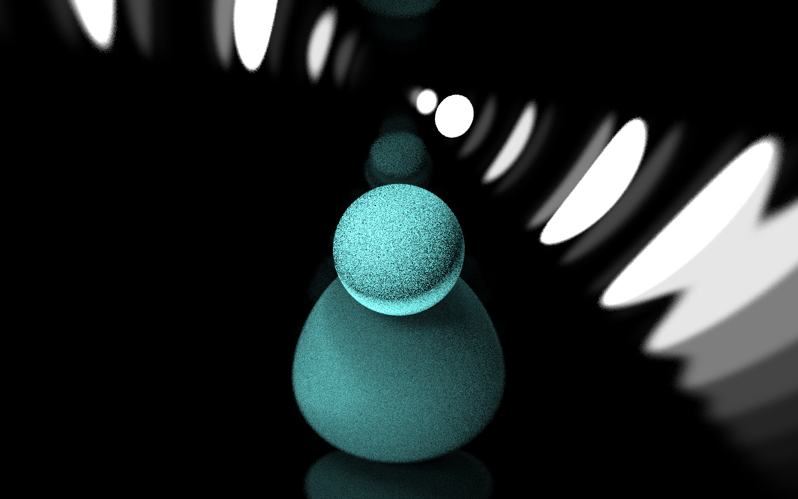
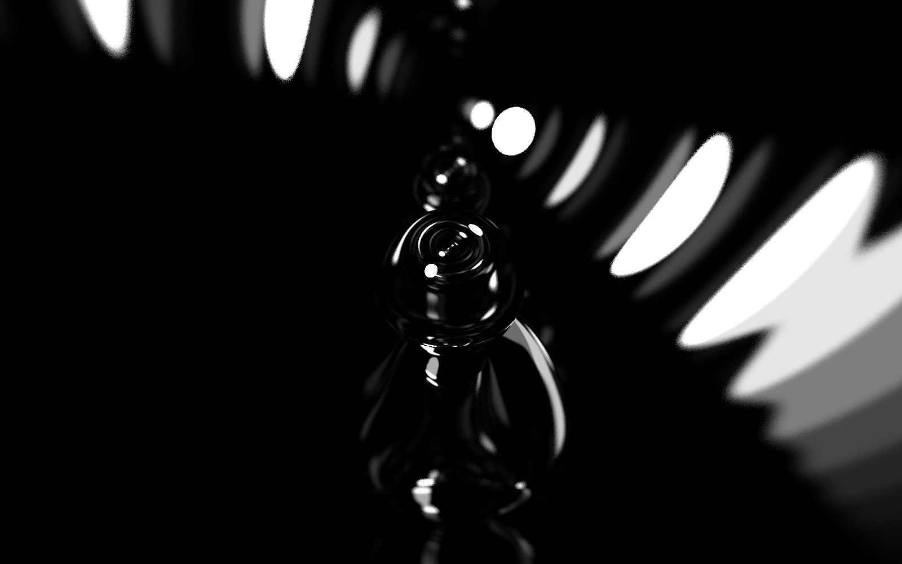
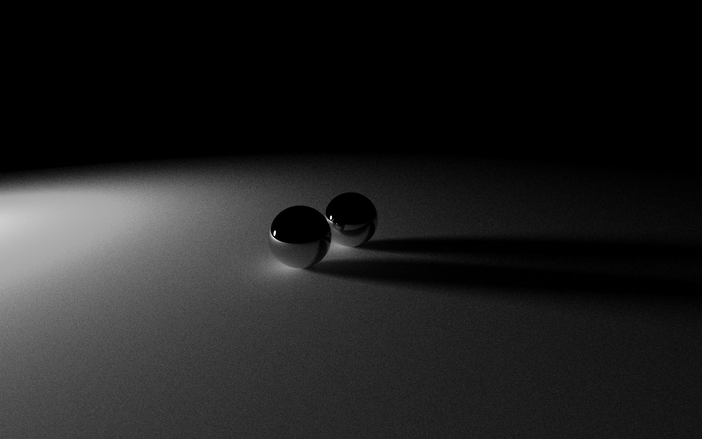
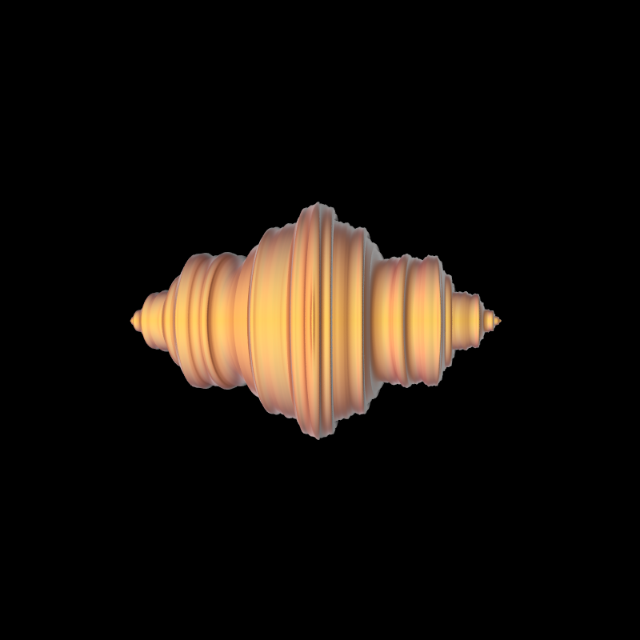
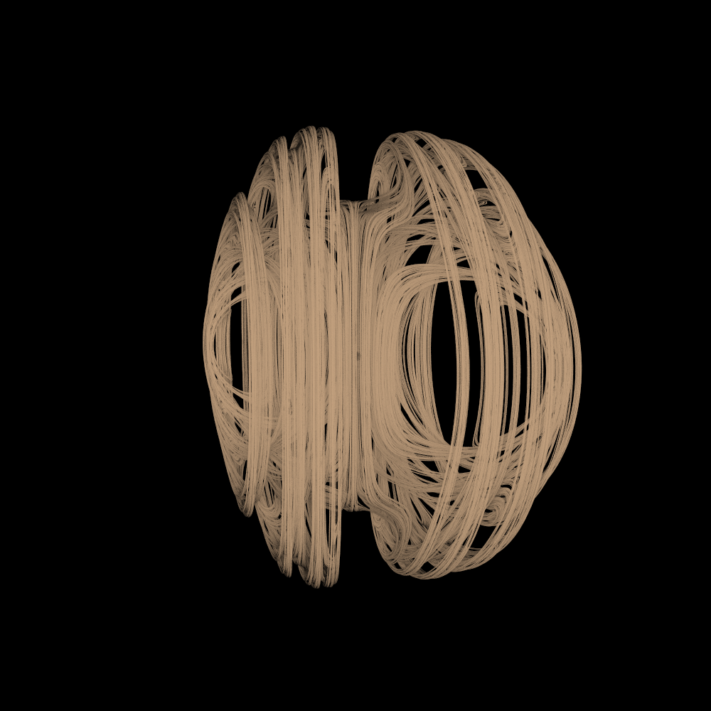
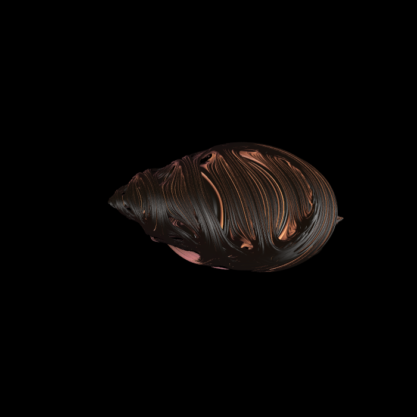

# TFG

to compile :

```
g++-11 -Wall -g -O3 -std=c++20 *.cpp -o main
```
to run:

```
./main
```

image examples:

(you can find all images in /output folder)

<p align="center">

  <br/>
  blue ball inside metallic ball
</p>
<p align="center">
  <br/>
  metallic ball inside an other metallic ball
</p>
<p align="center">
  <br/>
  2 metallic balls on top of a planet with the sun on the left
</p>
<p align="center">
  <br/>
  Julia set fractal 
</p>
<p align="center">
  <br/>
  Julia set Fractal
</p>
<p align="center">
  <br/>
  Julia set fractal
</p>

